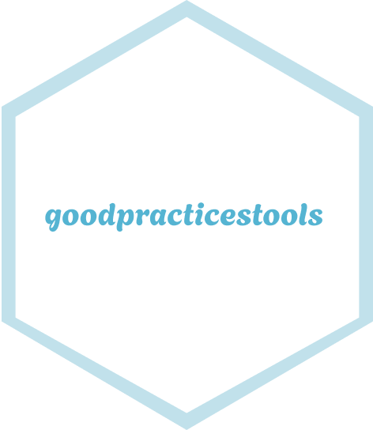
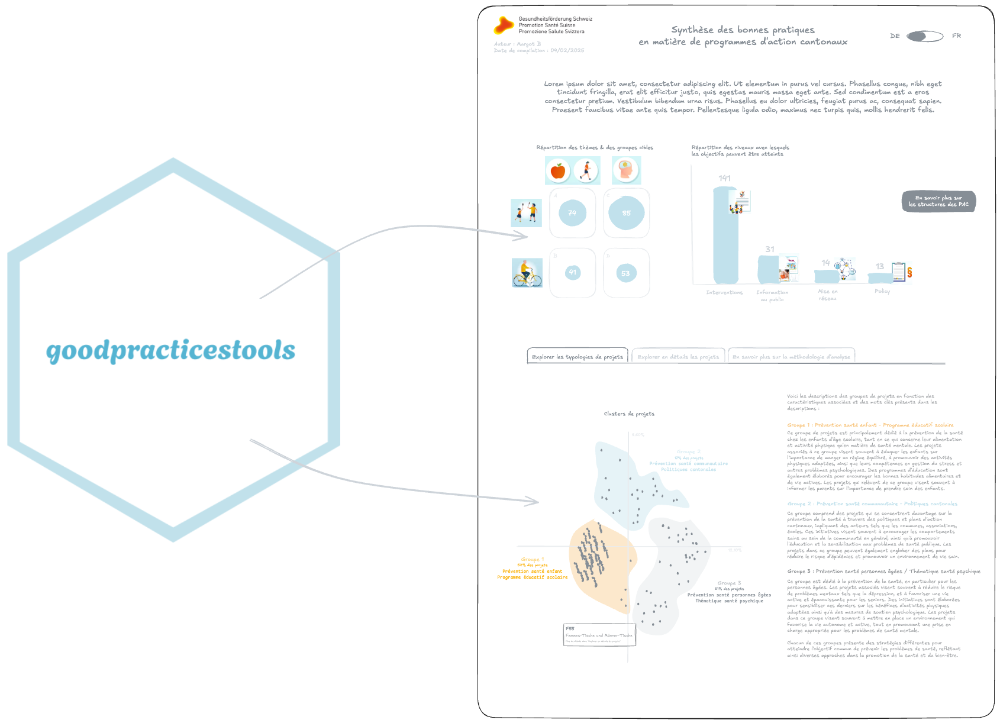

<!-- README.md is generated from README.Rmd. Please edit that file -->

```{r, include = FALSE}
knitr::opts_chunk$set(
  collapse = TRUE,
  comment = "#>",
  fig.path = "man/figures/README-",
  out.width = "100%"
)
```

# {goodpracticestools}  {.unlisted}

<!-- badges: start -->
[](https://github.com/promotionsante/goodpracticestools/actions/workflows/R-CMD-check.yaml)
[](https://lifecycle.r-lib.org/articles/stages.html#experimental)
<!-- badges: end -->

## Overview

The goal of `{goodpracticestools}` is to allows the person generating the overview *"Summary of Best Practices in Cantonal Action Programs"* by Promotion Santé Suisse" to enrich it with predefined analytical elements (charts, text, etc.).

```{r, echo=FALSE, out.width="70%", fig.align='center'}

```


## Installation

You can install `{goodpracticestools}` from [GitHub](https://github.com/) with:

``` r
# install.packages("pak")
pak::pak("promotionsante/goodpracticestools")
```

## Documentation

As the designer of the HTML overview, you will find several elements in the package documentation to help you use the different features:

- [How to prepare data for statistical analysis](https://promotionsante.github.io/goodpracticestools/articles/how-to-prepare-data-for-statistical-analysis.html)
- [How to explore the projects graphically](https://promotionsante.github.io/goodpracticestools/articles/how-to-explore-the-projects-graphically.html)
- [How to obtain a typology of projects](https://promotionsante.github.io/goodpracticestools/articles/how-to-obtain-a-typology-of-projects.html)

**Techinal documentation**

As the developer of this package, you will find several articles in the "Tech articles" tab to help you understand how to maintain this package. In particular, you will find the following articles:

- [How to maintain this package](https://promotionsante.github.io/goodpracticestools/articles/tech-how-to-maintain-this-package.html)
- [Coverage report](https://promotionsante.github.io/goodpracticestools/articles/coverage-report.html)
- [Architecture Decision Records](https://promotionsante.github.io/goodpracticestools/articles/tech-adr.html)
- [Dependencies Licenses](https://promotionsante.github.io/goodpracticestools/articles/tech-deps.html)
