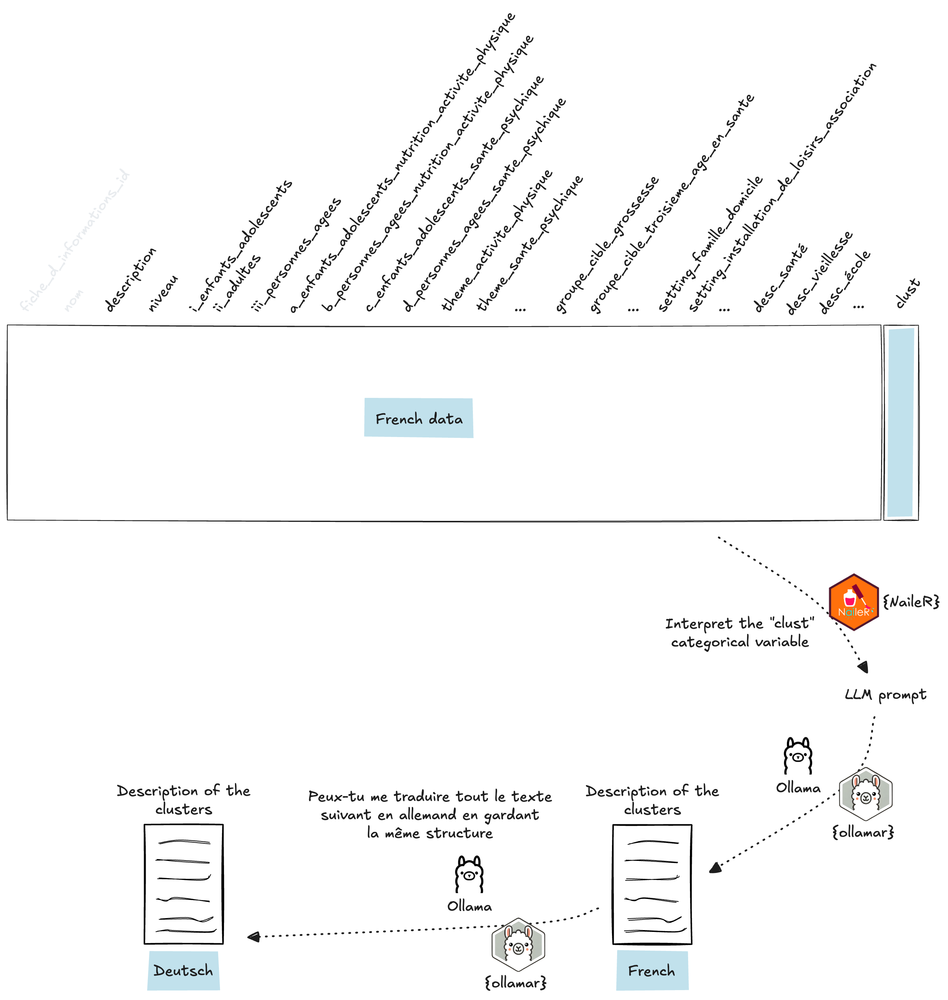

```{r, include = FALSE}
knitr::opts_chunk$set(
  collapse = TRUE,
  comment = "#>"
)
```

```{r setup, warning=FALSE, message=FALSE}
# library(goodpracticestools)
pkgload::load_all()
```

## How to explore the variability of the projects

The data was prepared using the `prepare_data()` function. See the article [How to prepare data for statistical analysis](https://promotionsante.github.io/goodpracticestools/articles/how-to-prepare-data-for-statistical-analysis.html) for more details.

```{r}
data("data_fr")
```

The data are analyzed using **Multiple Correspondence Analysis** (MCA), a statistical method that helps explore and visualize relationships between several categorical variables. 

In this analysis, the active variables are as follows: 

- the A/B/C/D columns,
- the level column, 
- the theme columns, 
- the target groups columns,  
- and the settings columns. 

MCA allows for the identification of underlying structures and associations between these variables, providing a clear view of the links and patterns present in the data. 

Following the MCA, a **Hierarchical Clustering on Principal Components** (HCPC) is performed to further group similar observations and enhance the interpretation of the results.

The `get_clusters()` function realizes the analysis:

```{r}
res_analysis <- get_clusters(
  data = data_fr
)
```

## How to plot the clusters of projects

The `plot_clusters()` function then displays the factorial plane from the MCA with the representation of the clusters:

```{r, fig.width=6, fig.height=4, fig.align='center'}
plot_clusters(
  res_analysis = res_analysis
)
```

The German version is also available:

```{r}
data("data_raw_de")
```

```{r, fig.width=6, fig.height=4, fig.align='center'}
plot_clusters(
  res_analysis = res_analysis, 
  data_raw_de = data_raw_de,
  language = "de"
)
```

## How to interpret the clusters of projects

The interpretation of the clusters resulting from the typology is done using the [`{NaileR}`](https://cran.r-project.org/web/packages/NaileR/index.html) package. This package allows generating an LLM prompt to analyze the categorical latent variable corresponding to the cluster. All the information contained in the dataset prepared in French (excepting the columns with the id and the one with the name) is used as explanatory variables to describe the clusters.

The generated LLM prompt is then provided to the Ollama LLM, by using the [`{ollamar}`](https://cran.r-project.org/web/packages/ollamar/index.html) package.

The process is described in the diagram below:

```{r, echo=FALSE, out.width="100%", fig.align='center'}

```

The `interpret_clusters()` function realizes these operations. 

```{r, eval=FALSE}
res_interpret_clusters <- interpret_clusters(
  res_analysis = res_analysis
)
```

```{r, echo=FALSE}
data("res_interpret_clusters")
```

It first returns the introduction and request text used to generate the prompt, as well as the prompt itself.

```{r}
cat(res_interpret_clusters$intro_llm)
```

```{r}
cat(res_interpret_clusters$request_llm)
```

```{r}
cat(res_interpret_clusters$res_prompt_llm)
```

Finally, it returns the interpretation of the clusters in French and German:

```{r}
cat(res_interpret_clusters$res_desc_llm_fr)
```

```{r}
cat(res_interpret_clusters$res_desc_llm_de)
```

*To be included in an HTML report, the chunk parameter `results='asis'` must be used. This will produce the following result:*

```{r, results='asis'}
# results='asis' is used in this chunk
cat(res_interpret_clusters$res_desc_llm_fr)
```


