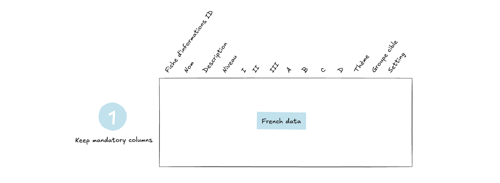
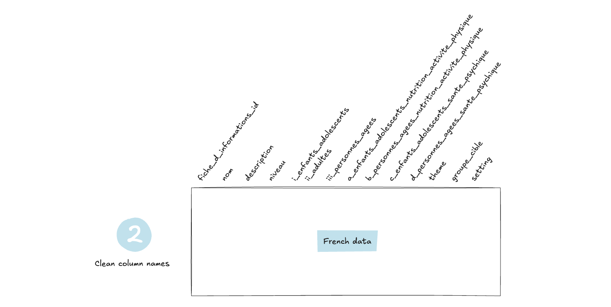
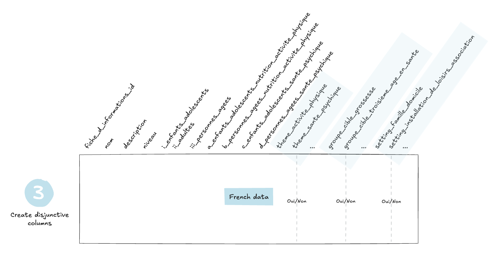
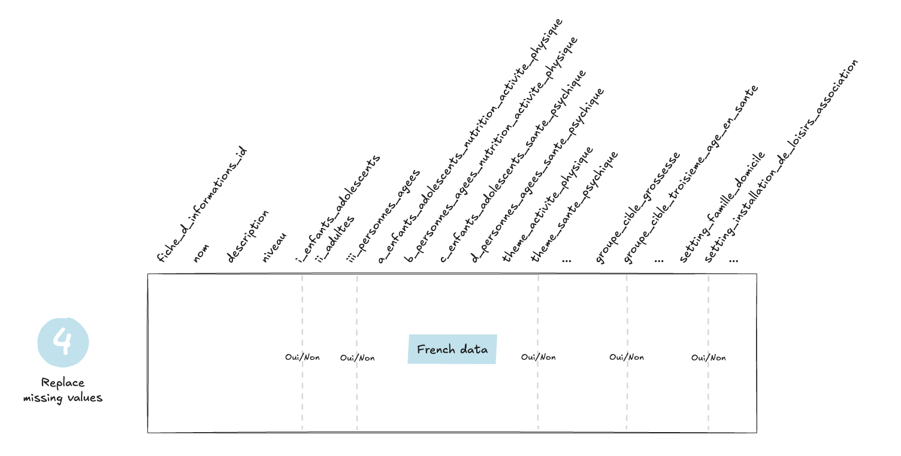
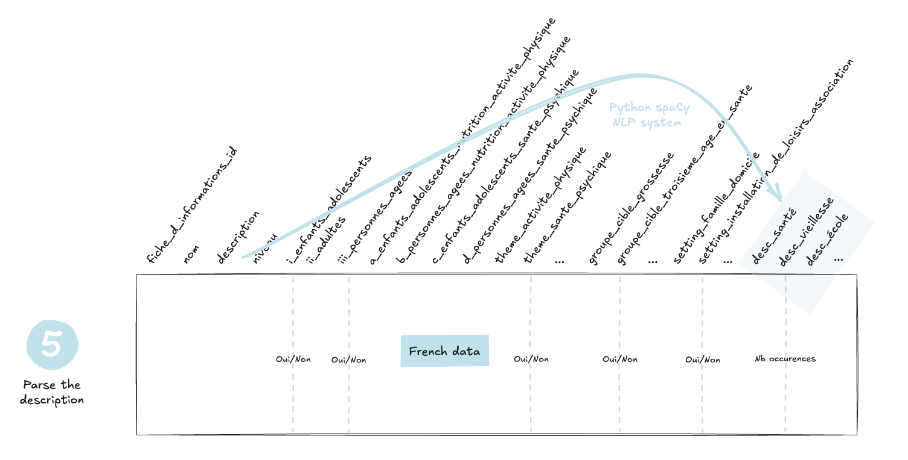

```{r, include = FALSE}
knitr::opts_chunk$set(
  collapse = TRUE,
  comment = "#>"
)
```

```{r setup, warning=FALSE, message=FALSE}
library(goodpracticestools)
library(dplyr)
library(stringr)
library(knitr)
```

## Raw data

The raw FR example data is available in the `"data_raw_fr"` dataset:

```{r}
data("data_raw_fr")
head(data_raw_fr) |> 
  mutate(
    across(
      everything(), 
      ~ str_trunc(.x, 20)
    )
  ) |> 
  kable()
```

The DE version is available in the `"data_raw_de"` dataset:

```{r}
data("data_raw_de")
head(data_raw_de) |> 
  mutate(
    across(
      everything(), 
      ~ str_trunc(.x, 20)
    )
  ) |> 
  kable()
```

## How to prepare data for statistical analysis

Only **French data** is used for the statistical analysis (see [ADR001](https://promotionsante.github.io/goodpracticestools/articles/tech-adr.html#adr001-management-of-two-languages-fr-and-de-in-data-analysis)).

The preparation steps are as follows:

-   Verify that the expected columns are present
-   Retain only the mandatory columns

```{r, echo=FALSE, out.width="70%", fig.align='center'}

```

-   Clean column names and use more explicit ones for certain columns

```{r, echo=FALSE, out.width="70%", fig.align='center'}

```

-   For the `Thème`, `Groupe cible`, and `Setting` columns, which contain multiple values per cell, convert them into disjunctive columns

```{r, echo=FALSE, out.width="70%", fig.align='center'}

```

-   Replace missing values (`NA`) in columns I, II, III and A, B, C, D

```{r, echo=FALSE, out.width="70%", fig.align='center'}

```

-   Parse the "description" column by (with lemmatization and after removing French stopwords) using the spaCy NLP system - see [{spacyr}](https://spacyr.quanteda.io/) for more details

```{r, echo=FALSE, out.width="70%", fig.align='center'}

```

These steps are implemented in the function `prepare_data()`:

```{r, warning=FALSE}
data_fr <- prepare_data(
  data = data_raw_fr,
  nb_min_word_in_desc = 30
)
```

The result is as follows:

```{r}
data_fr |> 
  select(
    fiche_d_informations_id,
    nom,
    i_enfants_adolescents,
    ii_adultes,
    iii_personnes_agees,
    a_enfants_adolescents_nutrition_activite_physique,
    b_personnes_agees_nutrition_activite_physique,
    c_enfants_adolescents_sante_psychique,
    d_personnes_agees_sante_psychique, 
    starts_with("theme"), 
    starts_with("groupe_cible"),
    starts_with("setting"),
    starts_with("desc")
  ) |> 
  head() |> 
  kable()
```
